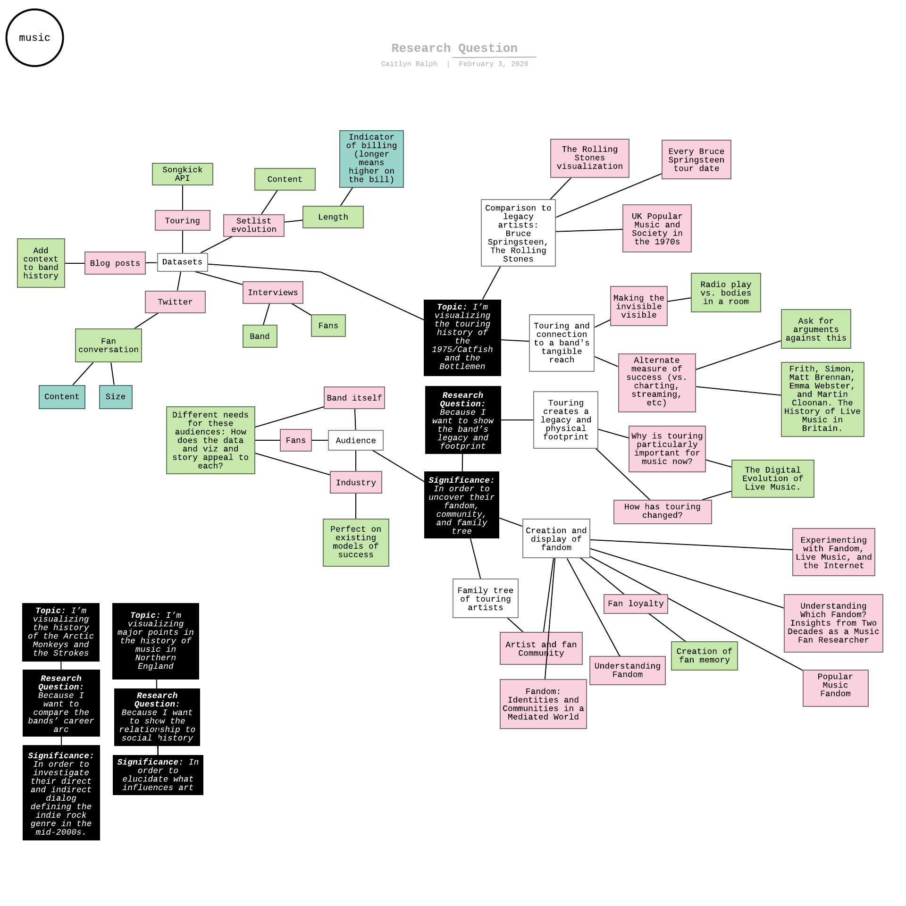

# caitlyn, major studio II

## exercise 3: prototyping

Visit my Figma document <a href="https://www.figma.com/file/1zedgacncy0HvA7ttZrDYG/MSII-THESIS-AH?node-id=0%3A1">here</a> and a user flow presentation <a href="https://www.figma.com/proto/1zedgacncy0HvA7ttZrDYG/MSII-THESIS-AH?node-id=0%3A1&scaling=min-zoom">here</a>.

Screenshots:

## exercise 2: form 

## exercise 1: research question

<ul>
  <li>music</li>
</ul>
<ul>
  <li>Topic: I’m visualizing the touring history of the 1975/Catfish and the Bottlemen
</li>
  <ul>
    <li>Datasets</li>
    <ul>
      <li>Touring</li>
      <ul>
        <li>Songkick API</li>
      </ul>
      <li>Blog posts</li>
      <ul>
        <li>Add context to band history</li>
      </ul>
      <li>Twitter</li>
      <ul>
        <li>Fan conversation</li>
        <ul>
          <li>Content</li>
          <li>Size</li>
        </ul>
      </ul>
      <li>Setlist evolution</li>
      <ul>
        <li>Content</li>
        <li>Length</li>
        <ul>
          <li>Indicator of billing (longer means higher on the bill)</li>
        </ul>
      </ul>
      <li>Interviews</li>
      <ul>
        <li>Fans</li>
        <li>Band</li>
      </ul>
    </ul>
    <li>Comparison to legacy artists: Bruce Springsteen, The Rolling Stones</li>
    <ul>
      <li>UK Popular Music and Society in the 1970s</li>
      <li>Every Bruce Springsteen tour date</li>
      <li>The Rolling Stones visualization</li>
    </ul>
    <li>Touring and connection to a band's tangible reach</li>
    <ul>
      <li>Making the invisible visible</li>
      <ul>
        <li>Radio play vs. bodies in a room</li>
      </ul>
      <li>Alternate measure of success (vs. charting, streaming, etc)</li>
      <ul>
        <li>Ask for arguments against this</li>
        <li>Frith, Simon, Matt Brennan, Emma Webster, and Martin Cloonan. The History of Live Music in Britain.</li>
      </ul>
    </ul>
  </ul>
</ul>
<ul>
  <li>Research Question: Because I want to show the band’s legacy and footprint</li>
  <ul>
    <li>Touring creates a legacy and physical footprint</li>
    <ul>
      <li>Why is touring particularly important for music now?</li>
      <ul>
        <li>The Digital Evolution of Live Music.</li>
      </ul>
      <li>How has touring changed?</li>
    </ul>
    <li>Significance: In order to uncover their fandom, community, and family tree</li>
    <ul>
      <li>Audience</li>
      <ul>
        <li>Band itself</li>
        <ul>
          <li>Different needs for these audiences: How does the data and viz and story appeal to each?</li>
        </ul>
        <li>Fans</li>
        <li>Industry</li>
        <ul>
          <li>Perfect on existing models of success</li>
        </ul>
      </ul>
      <li>Creation and display of fandom</li>
      <ul>
        <li>Experimenting with Fandom, Live Music, and the Internet</li>
        <li>Understanding Which Fandom? Insights from Two Decades as a Music Fan Researcher</li>
        <li>Popular Music Fandom</li>
        <li>Fandom: Identities and Communities in a Mediated World</li>
        <li>Understanding Fandom</li>
        <li>Fan loyalty</li>
        <ul>
          <li>Creation of fan memory</li>
        </ul>
      </ul>
      <li>Family tree of touring artists</li>
      <ul>
        <li>Artist and fan Community</li>
      </ul>
    </ul>
  </ul>
</ul>
<ul>
  <li>Topic: I’m visualizing the history of the Arctic Monkeys and the Strokes
</li>
  <ul>
    <li>Research Question: Because I want to compare the bands’ career arc</li>
    <ul>
      <li>Significance: In order to investigate their direct and indirect dialog defining the indie rock genre in the mid-2000s.</li>
    </ul>
  </ul>
</ul>
<ul>
  <li>Topic: I’m visualizing major points in the history of music in Northern England</li>
  <ul>
    <li>Research Question: Because I want to show the relationship to social history</li>
    <ul>
      <li>Significance: In order to elucidate what influences art</li>
    </ul>
  </ul>
</ul>

## research exercise: literature review 1/21/20
### topics: live music and nyc/london fashion

Breward, Christopher. Fashioning London: Clothing and the Modern Metropolis. Oxford: Berg, 2004.

Frith, Simon, Martin Cloonan, Matt Brennan, and Emma Webster. The History of Live Music in Britain. from Hyde Park to the Hacienda. London: Routledge, Taylor & Francis Group, 2019.

Jones, Angela Cresswell., and Rebecca Jane. Bennett. The Digital Evolution of Live Music. Routledge, 2015.

Milbank, Caroline Rennolds. New York Fashion: the Evolution of American Style. New York: Harry N. Abrams, 1996.
